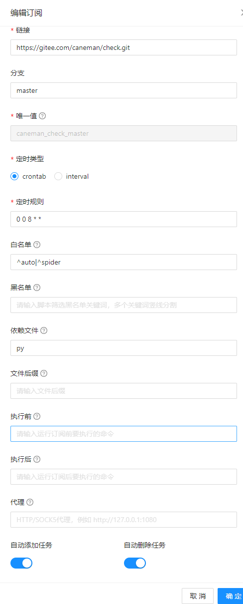
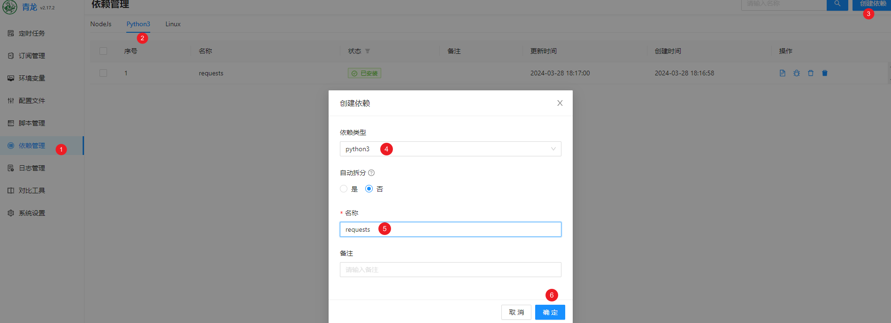
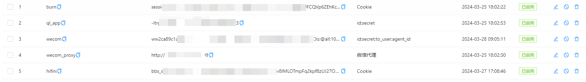
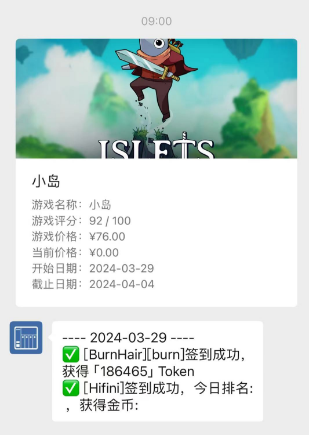

# 自动签到脚本集合

**基于青龙面板的自动签到脚本集合**

## 面板安装

青龙面板仓库地址: [https://github.com/whyour/qinglong](https://github.com/whyour/qinglong)

### docker-compose

```yaml
version: "3.5"
services:
  ql:
    image: whyour/qinglong
    container_name: ql
    restart: always
    environment:
      - TZ=Asia/Shanghai
    ports:
      - "5700:5700"
    volumes:
      - /home/ql:/ql/data
```

### docker

```bash
docker run -d -p 5700:5700 --name ql -v /home/ql:/ql/data -e TZ=Asia/Shanghai --restart=always whyour/qinglong
```

## 脚本安装

### 添加订阅

主界面 - 订阅管理 - 创建订阅，如下配置




### 安装依赖

主界面 - 依赖管理 - Python3 - 安装 `requests` 依赖



## 脚本支持列表

| 网站说明         | 环境变量名 | 环境变量值 | 示例                                | 补充说明                                                     |
| ---------------- | ---------- | ---------- | ----------------------------------- | ------------------------------------------------------------ |
| burnhair         | burn       | Cookie     | session=MTcxMDc1NjAyM3xEWDhFQVFM... | 可以创建多个环境变量名， burn、burn1、burn2.....burn99 (最多支持100个帐号) |
| hifini           | hifini     | Cookie     | bbs_sid=xxxxxx; bbs_token=xxxxx     | -                                                            |
| Epic免费游戏通知 | -          | -          |                                     | 设置企业微信通知器，开启脚本后自动通知                       |

## 日志推送

检测所有已启动的任务日志，抓取当天日志消息，根据消息头，选择指定的通知器进行推送，需要配合 **青龙面板应用** 使用

> 青龙面板 - 系统设置 - 应用设置 - 新建应用（需要权限: 定时任务、环境变量、日志管理）

|         通知器          |      消息头      |   环境变量名    |         环境变量值         |                             示例                             |         备注         |
| :---------------------: | :--------------: | :-------------: | :------------------------: | :----------------------------------------------------------: | :------------------: |
|        青龙面板         |        -         |     ql_app      |   cline_id;client_secret   |                        aaaaaa;bbbbbb                         | 通知器生效的前置需求 |
|  企业微信应用 - 纯文本  |    [企业微信]    |      wecom      | id;secret;to_user;agent_id |       ww2xxxxxx;B9kqCehzUU3hPQrzOeUxxxxxx;@all;1000002       |                      |
| 企业微信应用 - 图文卡片 |  [企业微信图片]  |      wecom      | id;secret;to_user;agent_id |       ww2xxxxxx;B9kqCehzUU3hPQrzOeUxxxxxx;@all;1000002       |                      |
|    企业微信应用代理     |        -         |   wecom_proxy   |       代理服务器地址       |                 http://111.111.111.111:9999                  |                      |
|     企业微信机器人      | [企业微信机器人] | wecom_robot_url |            url             | https://qyapi.weixin.qq.com/cgi-bin/webhook/send?key=xxxxxxxxxx |                      |



## 效果展示


